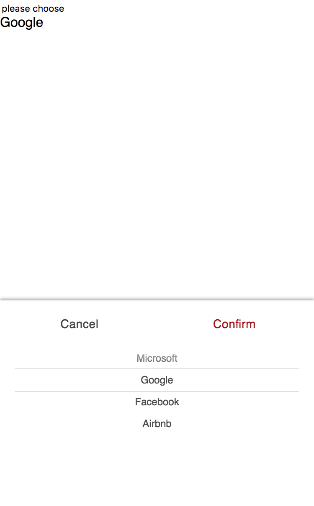

## ng2-picker

基于 *Angular2/4* 的滑轮选择组件（A货）。

项目本身是使用 [Angular CLI](https://github.com/angular/angular-cli) 生成的，主要是 *webpack* 的一大堆配置嫌烦，所以就借着巨人肩旁来快速开发。

### 简介

最近在用 [Angular4](https://angular.io/) 做一个项目，需要按照设计稿来实现一个类似 *ios* 原生的 *select* 效果，在网上找了很久都没有找到可以匹配 *Angular2* 的插件，于是在 *GitHub* 找到了[这个](https://github.com/ustbhuangyi/picker)，没有任何依赖，打包后的版本只有 `32Kb` 左右，当然是经过了自己的一番改造。

主要的改造是把 *HTML* 和 *CSS* 单独提取出来，这样比较适合 *Angular2* 的开发模式，每个组件都有对应单独的模版和样式文件。

还有一部分就是对 *js* 的改造，虽然没有大致看懂作者的思路，但是通过乱七八糟的断点调试，最后终于改成了一个单独文件，还解决了一些其他小问题。

> 在此非常感谢[原作者](https://github.com/ustbhuangyi)对开源的贡献。

### 截图



完全按照设计稿来写的样式，自己不是很懂设计。

### 开始

可以把项目克隆下来：

```bash
git clone https://github.com/Chen38/ng2-picker.git
```

最终的组件在 `src/app/picker` 下面，依赖 `src/vendor` 下的库，因为经过改造，所以不能用 *npm* 源上的包了。

```bash
# 安装
npm install

# 运行
npm run start

# ** NG Live Development Server is running on http://localhost:4200 **
```

也可以查看在线 [DEMO](https://chen38.github.io/ng2-picker/)

### 使用

模块文件引入：

```typescript
import { NgModule } from '@angular/core';
import { BetterPickerModule } from './picker/picker';

@NgModule({
  imports: [
    BetterPickerModule
  ]
})
export class AppModule { }
```

模版文件写入：

```html
<better-picker [data]="parentData" [show]="showPicker" [selectedIndex]="selectIndex" (onSelect)="onSelect($event)" (onChange)="onChange($event)"></better-picker>
```

组件文件传参和接受事件：

```typescript
// Output datas
private parentData: any[] = [
  [
    'Apple',
    '...'
  ]
];
private showPicker: boolean;
private selectIndex: number[] = [0, 0, 0];
// Input events
onSelect(value: SendData) {
  let { action, show, selectedValue, selectedIndex } = value;
  console.log(`action: ${action}, selectedValue: ${selectedValue}, selectedIndex: ${selectedIndex}`);
  this.showPicker = show;
}
onChange(value: any) {
  let { wheel, index } = value;
  console.log(`wheel: ${wheel}, index: ${index}`);
}
```

### 组件参数和事件：

#### 传入参数

- `data: any[]`：传入组件需要显示的数据，是一个二维数组，数组形式就代表列序号和列值。

> 如果需要第一个选项显示为空，可以在数据数组里设置为空字符串，并且默认显示一个横杠，可以自己定义样式。

```typescript
private parentData: any[] = [
  [
    '',
    'Apple',
    '...'
  ]
];
```

- `show: boolean`：激活和隐藏参数，实质是 **className** 添加和移除

- `selectedIndex: number[]`：初始化的选择序号，默认为 **[0, 0, 0]**

#### 返回触发事件

- `onSelect(value: SendData): EventEmitter<SendData>`：点击确定时触发，并向父组件传递每列选择的值 **selectedValue** 和 **selectedIndex**。

事件返回值定义了一个接口，用来确定返回的结果：

```typescript
interface SendData {
  action: string;
  show: boolean;
  selectedValue: string[];
  selectedIndex: number[];
}
```

> 新版本的*Angular*参数传递采用的是一种流的形式，所以只有一种方向的传递，因为我们选择了从父组件向子组件的传递方式，所以无法在子组件里改变传入的值并同时改变父组件的值，所以只能通过 `event emit` 的形式来改变父组件的值再传递给子组件，这么做确实比较复杂，目前我是没有想到什么好办法，主要也是刚起步，以后如有其他方法会改进。

- `onChange(value: any): EventEmitter<any>`：当一列滚动停止时触发，并向父组件传递列序号 **wheel** 和停止的位置 **index**。

### To Do List

- [ x ] 类似城市的三级或其他的二级联动，项目中已经写好了，之后会重新整理一下放上去
- [ ] 控制是否联动的方式应该需要设置一下
- [ x ] 需要记住每个 **picker** 的选中 **index**

## License

MIT
